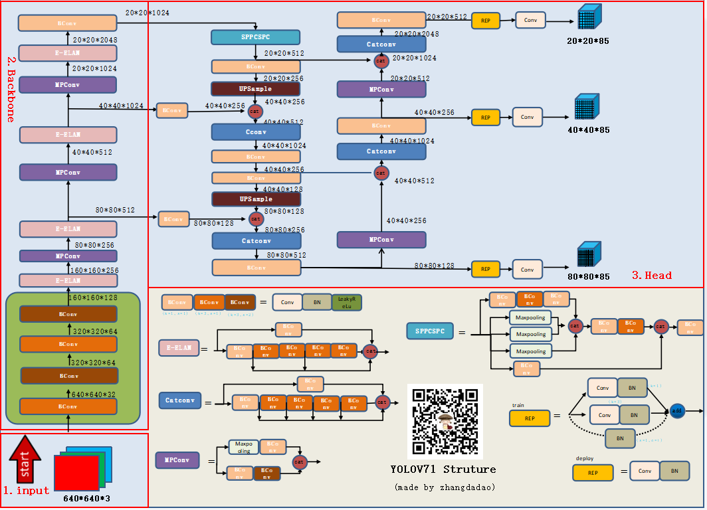

# 🎈🎈🎈YOLOC

## Introduction

🚀**YOLOC** is Combining different modules to build an different Object detection model.
<div align=“center”>

<div align='center'>
    
</div>

**🌟Combining** some modules and tricks to improve the YOLO detection model, the effect of using different datasets is inconsistent. Need to try and verify through specific experiments

#### YOLOC中支持的模块有：

- [x] 主流 🚀YOLOv3 模型网络结构；
- [x] 主流 🚀YOLOv4 模型网络结构；
- [x] 主流 🚀Scaled_YOLOv4 模型网络结构；
- [x] 主流 🚀YOLOv5 模型网络结构；
- [x] 主流 🚀YOLOv6 模型网络结构；
- [x] 主流 🚀YOLOv7 模型网络结构；
- [x] 主流 🚀YOLOX 模型网络结构；
- [x] 主流 🚀YOLOR 模型网络结构；
- [x] transformer架构的backbone、neck、head；
- [x] 改进的transformer系列的backbone、neck、head；
- [x] Attention系列的backbone、neck、head；
- [x] 基于anchor-free和anchor-based的检测器；
- [x] 🍉FPN、PANet、BiFPN等结构；
- [x] 🍉CIoU、DIoU、GIoU、EIoU、SIoU等损失函数；
- [x] 🍉NMS、Merge-NMS、Soft-NMS等NMS方法；
- [x] 🍉SE、CBAM、ECA、BAM、DANet...[详细链接🔗](#多种attention注意力机制) 等30+ Attention注意力机制；
- [x] 🍉SiLU、Hardswish、Mish、MemoryEfficientMish、FReLU、AconC、MetaAconC等激活函数；
- [x] 🍉Conv, GhostConv, Bottleneck, GhostBottleneck, SPP, SPPF, DWConv, MixConv2d, Focus, CrossConv, BottleneckCSP, CBAM, ResBlock_CBAM, CoordAtt, CrossConv, C3, CTR3, Involution, C3SPP, C3Ghost, CARAFE, nn.ConvTranspose2d, DWConvTranspose2d, C3x, SPPCSPC, GhostSPPCSPC, BottleneckCSPA, BottleneckCSPB, ConvSig, BottleneckCSPC, RepConv, RepConv_OREPA, RepBottleneck, RepBottleneckCSPA, RepBottleneckCSPB, RepBottleneckCSPC, Res, ResCSPA, ResCSPB, ResCSPC, RepRes, RepResCSPA, RepResCSPB, RepResCSPC, ResX, ResXCSPA, ResXCSPB, ResXCSPC, RepResX, RepResXCSPA, RepResXCSPB, RepResXCSPC, Ghost, GhostCSPA, GhostCSPB, GhostCSPC, SwinTransformerBlock, STCSPA, STCSPB, STCSPC, SwinTransformer2Block, ST2CSPA, ST2CSPB, ST2CSPC, conv_bn_relu_maxpool, Shuffle_Block, RepVGGBlock, CBH, LC_Block, Dense, DWConvblock, BottleneckCSP2, DWT, BottleneckCSP2SAM, VoVCSP等网络模型组合模块
代码 **./models/common.py文件** 内搜索🔍👉[对应模块链接🔗](https://github.com/Him-wen/YOLOC/blob/main/models/common.py)
...
...

- 🚀**yolo系列v3、v4、v5、v6、v7、x、r**以及其他改进的网络结构 
> 更新中

## 内置网络模型配置支持🚀

### 🎈YOLOv3
* ✅ yolov3-spp
* ✅ yolov3-tiny
* ✅ yolov3
...

### 🎈YOLOv4
* ✅ yolov4s-mish 
* ✅ yolov4m-mish
* ✅ yolov4l-mish
* ✅ yolov4x-mish
* ✅ yolov4-csp
* ✅ csp-p6-mish
* ✅ csp-p7-mish
...

### 🎈YOLOv5
* ✅ yolov5n
* ✅ yolov5s
* ✅ yolov5m
* ✅ yolov5l
* ✅ yolov5x

* ✅ yolov5-bifpn 
* ✅ yolov5-fpn
* ✅ yolov5-p2
* ✅ yolov5-p6
* ✅ yolov5-p7
* ✅ yolov5-panet
* ✅ yolov5l6
* ✅ yolov5m6
* ✅ yolov5n6
* ✅ yolov5s6
* ✅ yolov5x6
* ✅ yolov5s-ghost
* ✅ yolov5-transformer
...

### 🎈yolo_combining
* ✅ yolov5s_cbam
* ✅ yolov5Lite-s.yaml
* ✅ yolov5Lite-g.yaml
* ✅ yolov5Lite-c.yaml
* ✅ yolov5Lite-e.yaml
...

### 🎈Scaled_YOLOv4
* ✅ yolov4-p5
* ✅ yolov4-p6
* ✅ yolov4-p7
...

### 🎈YOLOR
* ✅ yolor-csp
* ✅ yolor-csp-x
* ✅ r50-csp
* ✅ x50-csp
* ✅ yolor-d6
* ✅ yolor-e6
* ✅ yolor-p6
* ✅ yolor-w6
* ✅ yolor-ssss-dwt
* ✅ yolor-ssss-s2d
...

### 🎈YOLOv6
* ✅ yolov6s
*  yolov6n
*  yolov6m
*  yolov6l
*  yolov6x
...

### 🎈YOLOX
* ✅ yolox n
* ✅ yolox tiny
* ✅ yolox s
* ✅ yolox m
* ✅ yolox l
* ✅ yolox x
* ✅ yolox xs
...

### 🎈YOLOv7
* ✅ yolov7
* ✅ yolov7-tiny
* ✅ yolov7-tiny-silu
* ✅ yolov7x
...


## 🚀 可选择的YOLO组合
#### 🌟损失函数
* **CIoU（默认）**
```python
# 代码
python train.py --loss_category CIoU
```
* **DIoU**
```python
# 代码
python train.py --loss_category DIoU
```
* **GIoU**
```python
# 代码
python train.py --loss_category GIoU
```
* **EIoU**
```python
# 代码
python train.py --loss_category EIoU
```
* **SIoU**
```python
# 代码
python train.py --loss_category SIoU
```
______________________________________________________________________

#### 🌟NMS
* **NMS（默认）**
```python
# 代码
python val.py
```
* **Merge-NMS**
```python
# 代码
python val.py --merge
```
* **Soft-NMS**
```python
# 代码
python val.py --soft
```
______________________________________________________________________

#### 🌟多种Attention注意力机制🚀🚀🚀

具体不同注意力机制Paper以及结构图👉👉👉[点击链接🔗](https://github.com/Him-wen/YOLOC/blob/main/docs/model.md)  

**Attention Series🚀🚀🚀**
1. 🎈External Attention
2. 🎈Self Attention
3. 🎈Simplified Self Attention
4. 🎈Squeeze-and-Excitation Attention
5. 🎈SK Attention
6. 🎈CBAM Attention
7. 🎈BAM Attention
8. 🎈ECA Attention
9. 🎈DANet Attention
10. 🎈Pyramid Split Attention (PSA)
11. 🎈Efficient Multi-Head Self-Attention(EMSA)
12. 🎈Shuffle Attention
13. 🎈MUSE Attention
14. 🎈SGE Attention
15. 🎈A2 Attention
16. 🎈AFT Attention
17. 🎈Outlook Attention
18. 🎈ViP Attention
19. 🎈CoAtNet Attention
20. 🎈HaloNet Attention
21. 🎈Polarized Self-Attention
22. 🎈CoTAttention
23. 🎈Residual Attention
24. 🎈S2 Attention
25. 🎈GFNet Attention
26. 🎈Triplet Attention
27. 🎈Coordinate Attention
28. 🎈MobileViT Attention
29. 🎈ParNet Attention
30. 🎈UFO Attention
31. 🎈MobileViTv2 Attention
______________________________________________________________________

#### 🌟激活函数
<div align='center'>

</div>

* **SiLU**

```python
# SiLU activation https://arxiv.org/pdf/1606.08415.pdf
# 代码(./utils/activations.py文件内搜索🔍)
class SiLU(nn.Module):
    ...
```
* **Hardswish**
```python
# Hard-SiLU activation
# 代码(./utils/activations.py文件内搜索🔍)
class Hardswish(nn.Module):
    ...
```
* **Mish**
```python
# Mish activation https://github.com/digantamisra98/Mish
# 代码(./utils/activations.py文件内搜索🔍)
class Mish(nn.Module):
    ...
```
* **MemoryEfficientMish**
```python
# Mish activation memory-efficient
# 代码(./utils/activations.py文件内搜索🔍)
class MemoryEfficientMish(nn.Module):
    ...
```
* **FReLU**
```python
# FReLU activation https://arxiv.org/abs/2007.11824
# 代码(./utils/activations.py文件内搜索🔍)
class FReLU(nn.Module):
    ...
```
* **AconC**
```python
r""" ACON activation (activate or not)
    AconC: (p1*x-p2*x) * sigmoid(beta*(p1*x-p2*x)) + p2*x, beta is a learnable parameter
    according to "Activate or Not: Learning Customized Activation" <https://arxiv.org/pdf/2009.04759.pdf>.
    """
# 代码(./utils/activations.py文件内搜索🔍)
class AconC(nn.Module):
    ...
```
* **MetaAconC**
```python
r""" ACON activation (activate or not)
    MetaAconC: (p1*x-p2*x) * sigmoid(beta*(p1*x-p2*x)) + p2*x, beta is generated by a small network
    according to "Activate or Not: Learning Customized Activation" <https://arxiv.org/pdf/2009.04759.pdf>.
    """
# 代码(./utils/activations.py文件内搜索🔍)
class MetaAconC(nn.Module):
    ...
```
______________________________________________________________________

#### 🔥YOLO系列热力图可视化
<div align=“center”>


<div>

[🔗OD_Heatmap链接](https://github.com/Him-wen/OD_Heatmap)


## 🍋 网络模型架构图
* [yolov7](https://github.com/Him-wen/YOLOC#yolov7)
* [yolov6](https://github.com/Him-wen/YOLOC#yolov7)
* [yolox](https://github.com/Him-wen/YOLOC#yolox)
* [yolov5](https://github.com/Him-wen/YOLOC#yolov5)
* [yolor](https://github.com/Him-wen/YOLOC#yolor)
* [pp-yoloe](https://github.com/Him-wen/YOLOC#pp-yoloe)
* [pp-yolo2](https://github.com/Him-wen/YOLOC#pp-yolo2)
* [pp-yolo](https://github.com/Him-wen/YOLOC#pp-yolo)
* [scaled_yolov4](https://github.com/Him-wen/YOLOC#scaled_yolov4)
* [yolov4](https://github.com/Him-wen/YOLOC#yolov4)
* [yolov3](https://github.com/Him-wen/YOLOC#yolov3)  
更新...

### YOLOv7🚀🎈




______________________________________________________________________

### YOLOv6🚀🎈


______________________________________________________________________

### YOLOX🚀🎈


______________________________________________________________________

### YOLOv5🚀🎈


详细


______________________________________________________________________

### YOLOR🚀🎈


______________________________________________________________________

### PP-YOLOE🚀🎈


______________________________________________________________________

### PP-YOLO2🚀🎈


______________________________________________________________________

### PP-YOLO🚀🎈


______________________________________________________________________


### Scaled_YOLOv4🚀🎈


______________________________________________________________________

### YOLOv4🚀🎈


______________________________________________________________________

### YOLOv3🚀🎈


以上网络模型结构图来自以下参考链接🔗
[链接1](https://zhuanlan.zhihu.com/p/543686792)  [链接2](https://mp.weixin.qq.com/s/DFSROue8InARk-96I_Kptg)  [链接3](https://blog.csdn.net/qq_37541097/article/details/125132817)  [链接4](https://blog.csdn.net/qq_37541097/article/details/123594351)  [链接5](https://zhuanlan.zhihu.com/p/524548477)  [链接6](https://arxiv.org/abs/2011.08036)  [链接7](https://blog.csdn.net/qq_37541097/article/details/123229946)  [链接8](https://zhuanlan.zhihu.com/p/143747206)

______________________________________________________________________

## 🍉 Documentation
[model配置yaml文件](docs/model.md)
<details open>
<summary>教程</summary>

- [训练自定义数据](https://github.com/ultralytics/yolov5/wiki/Train-Custom-Data)  🚀 推荐
- [获得最佳训练效果的技巧](https://github.com/ultralytics/yolov5/wiki/Tips-for-Best-Training-Results)  ☘️ 推荐
- [使用 Weights & Biases 记录实验](https://github.com/ultralytics/yolov5/issues/1289)  🌟 新
- [Roboflow：数据集、标签和主动学习](https://github.com/ultralytics/yolov5/issues/4975)  🌟 新
- [多GPU训练](https://github.com/ultralytics/yolov5/issues/475)
- [PyTorch Hub](https://github.com/ultralytics/yolov5/issues/36)  ⭐ 新
- [TFLite, ONNX, CoreML, TensorRT 导出](https://github.com/ultralytics/yolov5/issues/251) 🚀
- [测试时数据增强 (TTA)](https://github.com/ultralytics/yolov5/issues/303)
- [模型集成](https://github.com/ultralytics/yolov5/issues/318)
- [模型剪枝/稀疏性](https://github.com/ultralytics/yolov5/issues/304)
- [超参数进化](https://github.com/ultralytics/yolov5/issues/607)
- [带有冻结层的迁移学习](https://github.com/ultralytics/yolov5/issues/1314) ⭐ 新
- [YOLOv5架构概要](https://github.com/ultralytics/yolov5/issues/6998) ⭐ 新

</details>

______________________________________________________________________

## 🎓 Acknowledgement

<details><summary> <b>Expand</b> </summary>

* [AlexeyAB.darknet](https://github.com/AlexeyAB/darknet)
* [yolov3](https://github.com/ultralytics/yolov3)
* [yolov4](https://github.com/WongKinYiu/PyTorch_YOLOv4)
* [scaled_yolov4](https://github.com/WongKinYiu/ScaledYOLOv4)
* [yolov5](https://github.com/ultralytics/yolov5)
* [yolov6](https://github.com/meituan/YOLOv6)
* [yolov7](https://github.com/WongKinYiu/yolov7)
* [yolor](https://github.com/WongKinYiu/yolor)
* [yolox](https://github.com/Megvii-BaseDetection/YOLOX)
* [yolou](https://github.com/jizhishutong/YOLOU)
* [attention](https://github.com/xmu-xiaoma666/External-Attention-pytorch)
</details>

______________________________________________________________________

## 🌰 Statement
<details><summary> <b>Expand</b> </summary>

* The content of this site is only for sharing notes. If some content is infringing, please use issue to contact to delete it